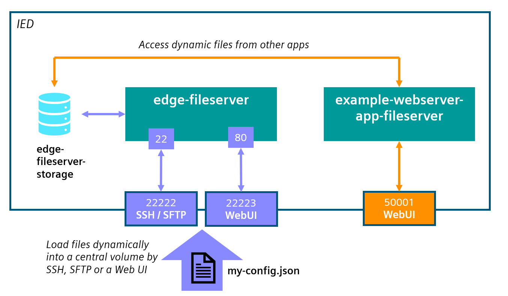
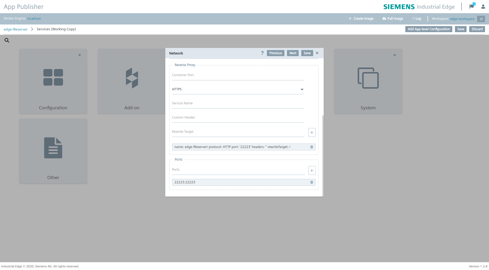
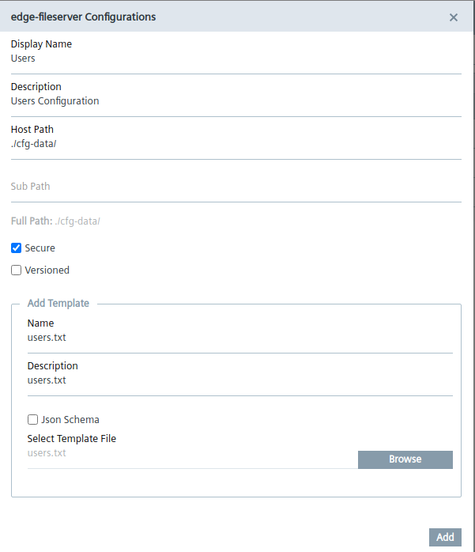
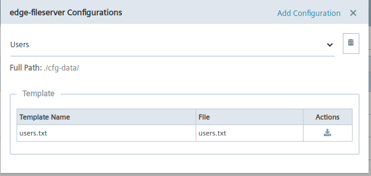
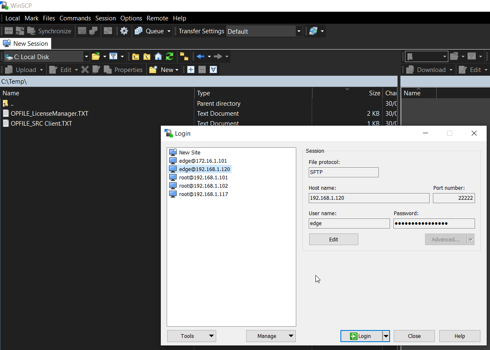
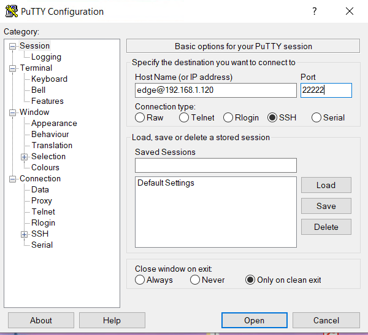
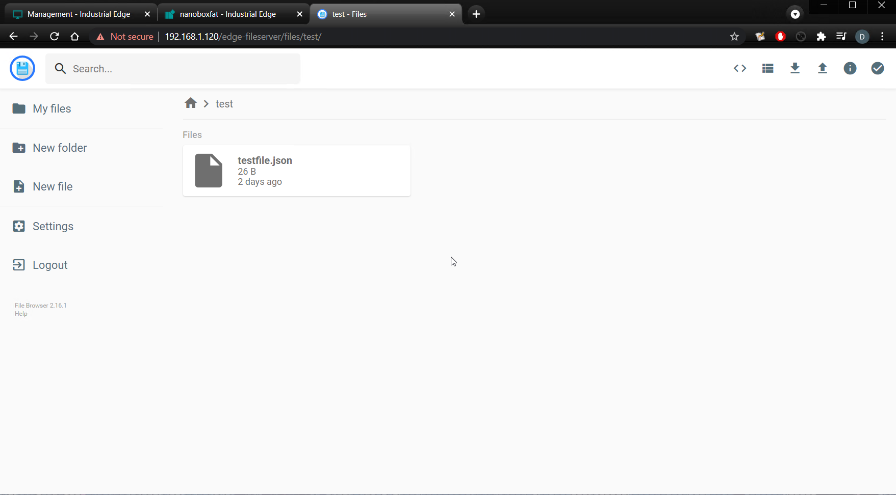
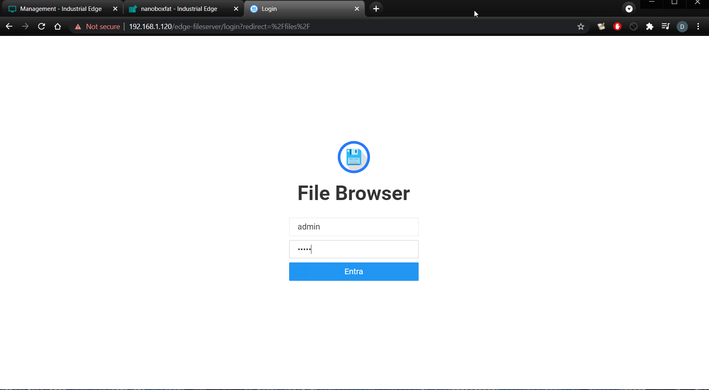

# Edge FileServer App

An Edge App that will create a Volume for files storage reachable from SFTP, SSH or Web UI File Browser.

- [Edge FileServer App](#edge-fileserver-app)
  - [Description](#description)
    - [Overview](#overview)
    - [Tasks](#tasks)
  - [Requirements](#requirements)
    - [Used Components](#used-components)
    - [Prerequisites](#prerequisites)
  - [Installation](#installation)
    - [Download the App](#download-the-app)
    - [Create new Standalone Application](#create-new-standalone-application)
    - [Setup Reverse Proxy for application endpoints](#setup-reverse-proxy-for-application-endpoints)
    - [Create configuration for the application](#create-configuration-for-the-application)
    - [Upload application to Industrial Edge Management](#upload-application-to-industrial-edge-management)
      - [Connect your Industrial Edge App Publisher](#connect-your-industrial-edge-app-publisher)
    - [Import a Standalone Application in Industrial Edge Management](#import-a-standalone-application-in-industrial-edge-management)
  - [Usage](#usage)
    - [Connecting with SFTP Protocol](#connecting-with-sftp-protocol)
    - [Connecting with SSH Clients](#connecting-with-ssh-clients)
    - [Connecting with FileBrowser Web Ui](#connecting-with-filebrowser-web-ui)
    - [Share Volume with other applications](#share-volume-with-other-applications)
  - [Build](#build)
    - [`edge-fileserver-sftp`](#edge-fileserver-sftp)
    - [`edge-fileserver-browser`](#edge-fileserver-browser)
  - [Documentation](#documentation)
  - [Contribution](#contribution)
  - [License & Legal Information](#license--legal-information)

## Description

### Overview

This app will create a [Docker Volume](https://docs.docker.com/storage/volumes/) named `edge-fileserver-storage` that can be mounted in other Edge Applications for uploading new files and folders, editing configurations files or simply to access files dynamically in runtime.
Operations can be done either by remote connections of any File Manager application through SSH or SFTP Protocols or by using an integrated Web UI reachable on the Edge Device.

### Tasks

With edge-fileserver app is it possible to add, edit or remove files and folders from a permanent volume named `edge-fileserver-storage`.
This can be done through different connections such as SFTP, SSH and a Web interface. For more information see the [Usage](#usage) section below.

Another task of this application is to have a common central volume where multiple configurations files are stored and accessible from any containers in other Edge Apps running on same IED.
An [application example](example/README.md) is provided to fully understand how to use this app for connect `edge-fileserver-storage` volume to other Edge Applications.



See [Usage](#usage) section below for more details about how to use this application.

## Requirements

### Used Components

- OS: Windows or Linux
- Docker minimum V18.09
- Docker Compose V2.0 – V2.4
- Industrial Edge App Publisher (IEAP) V1.2.8
- Industrial Edge Management (IEM) V1.2.16
- Industrial Edge Device (IED) V1.2.0-56

### Prerequisites

Before proceeding to the installation below, you need to build  [docker-compose](src/docker-compose.yaml) file for creating the Docker images described in [Build](#build).
This can be easily done from this folder with the command below:

```bash
docker-compose up -d --build
```

## Installation

You find below the steps required for downloading the pre-compiled app or to creating and install an edge application starting from the source code here provided.
Please refer to [Documentation](#documentation) for detailed information about Industrial Edge App Development.

### Download the App

The **edge-fileserver** app can be downloaded in .app format using this secure Google Drive link:

- [edge-fileserver_0.0.9.app](https://drive.google.com/file/d/1CGKkv8N_jVyqyx6AfHyeoBB1KN4GrF0i/view?usp=sharing)

### Create new Standalone Application

- Open the **Industrial Edge App Publisher**
- Go to `Standalone Applications` section
- Import the [docker-compose](src/docker-compose.yaml) file using the `Import YAML` button
- The warnings
  `Build (Detail) (services >> edge-fileserver-sftp >> build) is not supported.`
  `Build (Detail) (services >> edge-fileserver-browser >> build) is not supported.`
  can be ignored, images are already built in [Prerequisites](#prerequisites) section above.
- If needed, set the **Reverse Proxy** functionality as mentioned [below](#setup-reverse-proxy-for-application-endpoints).
- If all is correctly setup, click on `Review` and `Validate & Create`.

### Setup Reverse Proxy for application endpoints

With Reverse Proxy is it possible to create a secured redirect URL based on a common name (e.g. `https://my-ied/my-app/`) instead of using the standard port redirect provided by Docker applications.

In the application provided, the service will expose the port 22223 for reaching a Web UI where is it possible to manage the files in the volume.
For a detailed description of the Reverse Proxy functionality please refer to official [Documentation](#documentation) below.

Reverse Proxy will be configured for `edge-fileserver-browser` service following the steps below:

- From the application creation menu, press the edit button of the `edge-fileserver-browser` service
- Go in the `Network` submenu and find the `Reverse Proxy` section:
  
- Insert a new reverse proxy configuration using parameters below:
  
  ```text
  Container Port: 22223
  Protocol: HTTP 
  Service Name: edge-fileserver/
  Rewrite Target: /
  ```

- Save and exit

### Create configuration for the application

With IE is it possible to create custom Configurators with configuration files in formats likes .json, .yaml, .txt and more.

This application permits to dynamically change users that can connect through SFTP or SSH and that can own the `edge-fileserver-storage` volume by modifying the content of [./cfg-data/users.txt](src/cfg-data/users.txt) file.

Here the Industrial Edge App Publisher is used to create an Template file for [./cfg-data/users.txt](src/cfg-data/users.txt) for the configuration of the application. By using this configuration during the installation, the user can eventually edit the users configuration.

Below the steps to create a configuration template via file upload:

- Open the Industrial Edge App Publisher
- Go to `Standalone Applications` section
- Open the `edge-fileserver` application
- Click on `Configurations` > `Add Configuration`

  - Enter a **name** and **description**
  - Enter `./cfg-data/` as host path
  - Enter a **template name** and **description**
  - Browse for the [users.txt](src/cfg-data/users.txt) file created here
  - Click `Add`


### Upload application to Industrial Edge Management

You find below a short description on how to publish your application in your IEM.

For more detailed information please see the official Industrial Edge GitHub guide for [uploading apps to the IEM](https://github.com/industrial-edge/upload-app-to-industrial-edge-management).

#### Connect your Industrial Edge App Publisher

- Connect your Industrial Edge App Publisher to your **Docker engine**
- Connect your Industrial Edge App Publisher to your **Industrial Edge Managment**

### Import a Standalone Application in Industrial Edge Management

- Create a new Project in the connected IEM or select a existing one
- Import the standalone application created [above](#create-new-standalone-application) to the selected IEM Project
- Press `Start Upload` to transfer the app to Industrial Edge Managment

Further information about using the Industrial Edge App Publisher can be found in the [IE Hub](https://iehub.eu1.edge.siemens.cloud/documents/appPublisher/en/start.html).

## Usage

The possible uses of this application are shown below:

### Connecting with SFTP Protocol

Connections via SFTP Protocol can be made with some popular SFTP Clients like [FIlezilla](https://filezilla-project.org/) or [WinSCP](https://winscp.net/eng/download.php):



- Connect with SFTP Protocol from internal network proxy-redirect:
  - `sftp://edge-fileserver-sftp:22`
- Connect with SFTP Protocol from external network:
  - `sftp://[device-ip-address]:22222`

The users that can connect to the storage via SFTP are specified in [./cfg-data/users.txt](src/cfg-data/users.txt) file. Default user is **edge** with password **edge**.

### Connecting with SSH Clients

Connecting with SSH Protocol can be made with some popular SSH Clients like [PuTTY](https://filezilla-project.org/) or direclty from a Linux Console:



- Connect with SSH Protocol from external network:
  - `ssh -p 22222 edge@[device-ip-address]`

The users that can connect to the storage via SSH are specified in [./cfg-data/users.txt](src/cfg-data/users.txt) file. Default user is **edge** with password **edge**.

### Connecting with FileBrowser Web Ui

Using the [FIleBrowser](https://filebrowser.org/features) Web UI is it possibile e.g. to create, add, edit or delete files and folders in the `edge-fileserver-storage` volume.



- Connect to WebUI from external network:
  - `http://[device-ip-address]:22223`

- Connect to WebUI from external network with proxy enabled:
  - `https://[device-ip-address]/edge-fileserver/`

The default user that can access to WebUI is **admin** with password **admin** as mentioned [here](https://filebrowser.org/installation#quick-setup).


### Share Volume with other applications

The main task of this application is to create an easy-to-manage Docker Volume that any containers in other Edge Apps running on same IED can use to read configuration files dynamically, to have a common central point where multiple configurations files are stored and accessible.

In order to integrate the `edge-fileserver-storage` volume in a new edge application it is necessary to [install](#installation) the edge-fileserver app on the selected IED and then to mount that external volume in the docker-compose file of the new application by specifying the same volume name.

To demonstrate this task, an [application example](example/README.md) is available in this repository. Here a NodeJS Web App needs to read a JSON config file from the `edge-fileserver-storage` volume. Below a snippet from [docker-compose](example/src/docker-compose.yaml) file of the application example app that show how to mount the external volume and read a file from it:

```yaml
version: "2.4"

services:
  example-webserver-app-fileserver:
    image: example-webserver-app-fileserver:0.0.1
            # link config file from fileserver mounted volume path to required path for app and start it
    command: bash -c "ln -s /fileserver/2021/my-app/config/my-config.json /opt/app/config/config.json && node /usr/src/app/main.js" 
    volumes:
      - edge-fileserver-storage:/fileserver/ # where the fileserver volume that contains all configuration file is mounted
    ports:
      - 50001:5000
    restart: unless-stopped
    mem_limit: 150mb  # mandatory field for IE
    networks:
      - proxy-redirect  # default IE network

volumes:
  edge-fileserver-storage:
    name: edge-fileserver-storage
    external: true

networks:
  proxy-redirect:
    external: true
    name: proxy-redirect
```

Please refer to [application example](example/README.md)  documentation for more information.

## Build

Here is a short description on how the edge-fileserver app is built and how to eventually adapt it to your custom needs.

This application consist of two microservices:

### `edge-fileserver-sftp`

This service is based on [atmoz/sftp](https://hub.docker.com/r/atmoz/sftp) Docker image. Its an easy to use SFTP (SSH File Transfer Protocol) server with OpenSSH that you can use to interact with files and folders in `edge-fileserver-storage` volume.

The [Dockerfile](src/sftp/Dockerfile) copy the [set-permission](src/sftp/set-permissions.sh) script (as mentioned [here](https://github.com/atmoz/sftp#execute-custom-scripts-or-applications) that will take care of owning the container folder mounted at `edge-fileserver-storage` volume for each user specified in [./cfg-data/users.txt](src/cfg-data/users.txt).
In the Dockerfile it is also copied an edited version of [entrypoint](src/sftp/entrypoint) from the [original entrypoint](https://github.com/atmoz/sftp/blob/master/files/entrypoint) of atmoz/sftp service. The original version search for a users.conf file, but Industrial Edge App Configurator can handle only json, txt, yaml, csv file format. Here we have adapt the local variable `userConfPath` to the TXT format.
The **ports** used for SFTP and SSH Connection are 22222 from external networks and 22 from the internal `proxy-redirect` network.

The default **user** that can own files and folder in the `edge-fileserver-storage` volume is _edge_ with password _edge_ and _gid:uid=1000:1000_. This is provided by [./cfg-data/users.txt](src/cfg-data/users.txt) file as mentioned [here](https://github.com/atmoz/sftp#store-users-in-config).

The `edge-fileserver-storage` volume use a subdirectory (`/home/edge/storage`) of the user provided by [./cfg-data/users.txt](src/cfg-data/users.txt) that will own all files because the users can't create new files directly under their own home directory, as mentioned [here](https://github.com/atmoz/sftp#usage).

### `edge-fileserver-browser`

This service is based on [filebrowser/filebrowser](https://hub.docker.com/r/filebrowser/filebrowser) Docker image. It's a File Manager Web UI for interacting with files and folders on the `edge-fileserver-storage` volume.

As mentioned in the [official FileBrowser site](https://filebrowser.org/), it is a create-your-own-cloud-kind of software where you can install it on a server, direct it to a path and then access your files through a nice web interface. You have many available [features](https://filebrowser.org/features).

The building of the application is based on the [official FileBrowser Docker Guide](https://filebrowser.org/installation#docker)
The [Dockerfile](src/filebrowser/Dockerfile) copy the [filebrowser.json](filebrowser/filebrowser.json) configuration file where the storage path `/storage`, mounted on `edge-fileserver-storage` volume, is specified. Here it is also specified a new `database` path, the `baseURL` for the [reverse proxy setup](#setup-reverse-proxy-for-application-endpoints) and the `port` to be used for WebUI.

The **port** used for Web UI Connection is 22223 from external networks.
The default **user** that can access to WebUI is _admin_ with password _admin_ as mentioned [here](https://filebrowser.org/installation#quick-setup).

Also, in the [Dockerfile](src/filebrowser/Dockerfile) the [start](src/filebrowser/start.sh) script is copied for initializing an empty database of the ui configuration and for owning with the first user from the list in [./cfg-data/users.txt](src/cfg-data/users.txt) file the `/storage` folder mounted at `edge-fileserver-storage` volume. Then the filebrowser application is started with `/filebrowser` command.
When a user from WebUI use a file, this needs to be done with a user with same privileges of the users specified in the [./cfg-data/users.txt](src/cfg-data/users.txt) file, This is handle by [su-exec](https://github.com/ncopa/su-exec) package that is used to run  `/filebrowser` command with the right user,

## Documentation

- [atmoz/sftp GitHub Page](https://github.com/atmoz/sftp)
- [FileBrowser GitHub Page](https://github.com/filebrowser/filebrowser)
- [Handling permission with Docker Volumes](https://denibertovic.com/posts/handling-permissions-with-docker-volumes/)

You can find further documentation and help about Industrial Edge in the following links:

- [Industrial Edge Hub](https://iehub.eu1.edge.siemens.cloud/#/documentation)
- [Industrial Edge Forum](https://www.siemens.com/industrial-edge-forum)
- [Industrial Edge landing page](https://new.siemens.com/global/en/products/automation/topic-areas/industrial-edge/simatic-edge.html)
- [Industrial Edge GitHub page](https://github.com/industrial-edge)
- [Industral Edge App Developer Guide](https://support.industry.siemens.com/cs/ww/en/view/109795865)

## Contribution

Thanks for your interest in contributing. Anybody is free to report bugs, unclear documentation, and other problems regarding this repository in the Issues section or, even better, is free to propose any changes to this repository using Merge Requests.

## License & Legal Information

Please read the [Legal Information](LICENSE.md).
