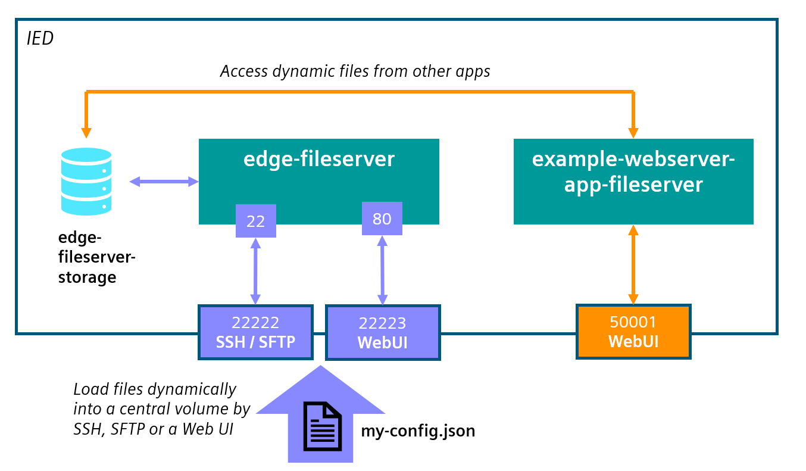
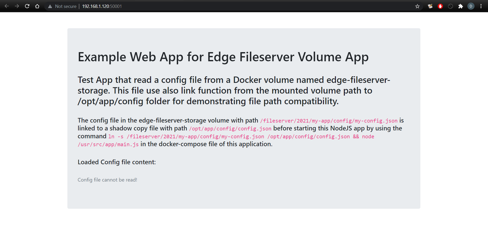
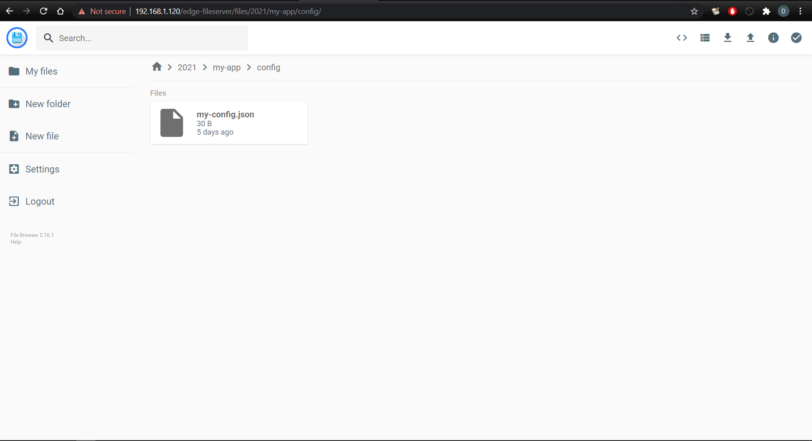
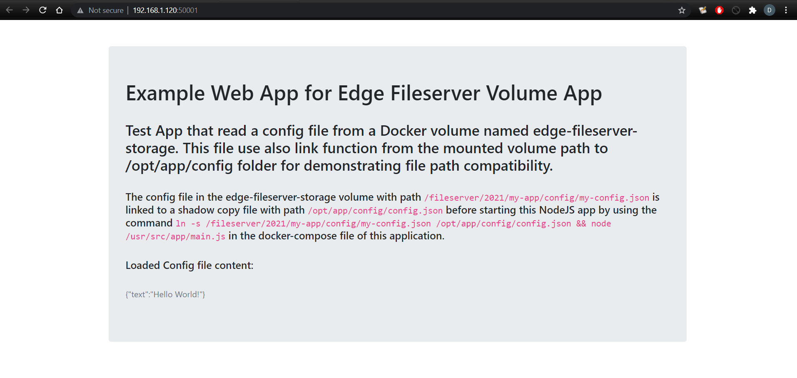

# Example Webserver App with custom config file from edge-fileserver application

This Application example shows how to get a config file of [edge-fileserver](../README.md) Edge App.

- [Example Webserver App with custom config file from edge-fileserver application](#example-webserver-app-with-custom-config-file-from-edge-fileserver-application)
  - [Description](#description)
    - [Overview](#overview)
    - [Tasks](#tasks)
  - [Requirements](#requirements)
    - [Used Components](#used-components)
    - [Prerequisites](#prerequisites)
  - [Installation](#installation)
    - [Download the App](#download-the-app)
    - [Create new Standalone Application](#create-new-standalone-application)
    - [Upload application to Industrial Edge Management](#upload-application-to-industrial-edge-management)
      - [Connect your Industrial Edge App Publisher](#connect-your-industrial-edge-app-publisher)
    - [Import a Standalone Application in Industrial Edge Management](#import-a-standalone-application-in-industrial-edge-management)
  - [Usage](#usage)
    - [Connect to Webserver UI](#connect-to-webserver-ui)
    - [Link External Volume files to custom files inside services](#link-external-volume-files-to-custom-files-inside-services)
  - [Build](#build)
  - [Documentation](#documentation)
  - [Contribution](#contribution)
  - [License & Legal Information](#license--legal-information)

## Description

### Overview

This application is a simple NodeJS Webserver that shows how it is possible to get a configuration file stored with [edge-fileserver](../README.md) edge app in its volume called `edge-fileserver-storage`.

### Tasks

With this example application we mainly shows how to develop a custom webserver application for Industrial Edge with NodeJS and how those kind of applications can access to different configuration files stored in the `edge-fileserver-storage` volume.



See [Usage](#usage) section below for more details about how to use this application.

## Requirements

### Used Components

- OS: Windows or Linux
- Docker minimum V18.09
- Docker Compose V2.0 – V2.4
- Industrial Edge App Publisher (IEAP) V1.2.8
- Industrial Edge Management (IEM) V1.2.16
- Industrial Edge Device (IED) V1.2.0-56

### Prerequisites

Before proceeding to the [installation](#installation) below you need to:

- build  [docker-compose](src/docker-compose.yaml) file for creating the Docker images described in [Build](#build).
This can be easily done from this folder with the command below:

```bash
docker-compose up -d --build
```

- install on the same edge device that you will use also the [edge-fileserver](../README.md) app as the `edge-fileserver-storage` volume is needed for this example app.

- create a custom configuration file named my-config.json in the `edge-fileserver-storage` volume. You can also use the provided [my-config.json](src/my-config.json) file.

## Installation

You find below the steps required for downloading the pre-compiled app or to creating and install an edge application starting from the source code here provided.
Please refer to [Documentation](#documentation) for detailed information about Industrial Edge App Development.

### Download the App

The **edge-fileserver** app can be downloaded in .app format using this secure Google Drive link:

- [example-webserver-app-fileserver_0.0.4.app](https://drive.google.com/file/d/1S4W1L2xEYldEB8yIvc0LLritMjfLos6I/view?usp=sharing)

### Create new Standalone Application

- Open the **Industrial Edge App Publisher**
- Go to `Standalone Applications` section
- Import the [docker-compose](src/docker-compose.yaml) file using the `Import YAML` button
- The warning
  `Build (Detail) (services >>  example-webserver-app-fileserver >> build) is not supported.`
  can be ignored.
- Click on `Review` and `Validate & Create`.

### Upload application to Industrial Edge Management

You find below a short description on how to publish your application in your IEM.

For more detailed information please see the official Industrial Edge GitHub guide for [uploading apps to the IEM](https://github.com/industrial-edge/upload-app-to-industrial-edge-management).

#### Connect your Industrial Edge App Publisher

- Connect your Industrial Edge App Publisher to your **Docker engine**
- Connect your Industrial Edge App Publisher to your **Industrial Edge Managment**

### Import a Standalone Application in Industrial Edge Management

- Create a new Project in the connected IEM or select a existing one
- Import the standalone application created [above](#create-new-standalone-application) to the selected IEM Project
- Press `Start Upload` to transfer the app to Industrial Edge Managment

Further information about using the Industrial Edge App Publisher can be found in the [IE Hub](https://iehub.eu1.edge.siemens.cloud/documents/appPublisher/en/start.html).

## Usage

This application is intended as an example to demonstrate how to use the [edge-fileserver](../README.md) application as storage for the configuration files of other applications, for this reason it does not present any particular functionality, except to show how to develop or adapt a Docker application that needs to use files loaded manually by users in a dynamic way.

The possible uses of this example application are shown below:

### Connect to Webserver UI

This application has a Web UI that can be used to display the contents of a JSON file uploaded to a specific folder in the edge-fileserver application.
In the [build](#build) section of this document you can find more details about how the webserver is built.

- Connect to WebUI from external network:
  - `http://[device-ip-address]:50001`
  


In the screenshot above the Web UI shows that no config file is present in the `edge-fileserver-storage` volume. In the next section we will upload a file to the edge-fileserver application and explain how to create links from the `edge-fileserver-storage` volume to this example web app.

### Link External Volume files to custom files inside services

In this application is shown an example of how it is possible to dynamically add specific configuration files using the external volume  `edge-fileserver-storage`, while maintaining the compatibility required by your Docker images regarding the paths of these configuration files.

In this case in fact the application, between the various [routes](src/app/routes/routes.js), will expose the **(GET) /config API** that will respond with the contents of the file `/opt/app/config/config.json` located inside the container. This file is not natively included in the [builded image](#build), but has to be inserted by the user when deploying the service.

A solution for uploading these files would be to use the configuration upload features offered by the Industrial Edge system (such as in the case of the /`cfg-data/users.txt` file of the [edge-fileserver](../README.md) application).

However, it might become necessary to upload several configuration files in different applications, but having the need to centralize all these files in a single volume reachable from outside. For this, an application such as [edge-fileserver](../README.md) might be useful, which offers the `edge-fileserver-storage` volume, reachable by SSH, SFTP and WebUI and which we can then mount in our applications, as in the example of this repository.

Unfortunately, it's not possible to mount a file that's already inside a volume directly into a service, but you'll need to mount the entire volume and then allow the application to reach the specific file. This means that the file inside the volume should be in the same path that is requested by the application (`/opt/app/config/config.json`). Surely having several applications, a generic path like this could easily be identical to the one requested by another service.

Suppose that we load the config file that we need with a different name (`my-config.json`) and on a path like `/2021/my-app/config/`:



So we need to find a way to match the path in the `edge-fileserver-storage` volume with the requested path from the webserver, but without modifying the source code of our application, acting only on the [docker-compose](src/docker-compose.yaml) file.
The solution is to mount the `edge-fileserver-storage` volume in a new folder of our service (such as `/fileserver/` ) and then create a [link](https://man7.org/linux/man-pages/man1/ln.1.html) between the config file in the volume and the path to the requested config file.

Using the parameter `command: bash -c "ln -sf /fileserver/2021/my-app/config/my-config.json /opt/app/config/config.json && node /usr/src/app/main.js"` we can create the link of the configuration file `my-config.json` with the file `config.json` and then the NodeJS application is started normally, as shown in the CMD of the [Dockerfile](src/Dockerfile).
This will allow the application to access the file correctly, as shown below:



This solution can be applied to several applications running in the same device, maintaining a folder system for the configuration files and others files required by the various applications that can be easily adapted to the different contexts required by the various images used.

## Build

Here is a short description on how this example app is built and how to eventually adapt it to your custom needs.

This application use a service named `example-webserver-app-fileserver`that is based on [node:14-alpine](https://hub.docker.com/_/node) Docker image.

This image should run the [source code](src/app) of the NodeJS server by launching the [main.js](src/app/main.js) file. Here the necessary libraries are loaded and the configured [routes](src/app/routes/routes.js) are exposed.
The webserver of this example application exposes the following API endpoints:

- **(GET) /** : the base root path. Returns the HTML page [index.html](src/app/templates/index.html) needed to display the instructions and the result of the request **(GET) /config API**.
- **(GET) /config** : returns the contents of the configuration file `config.json` contained in the `/opt/app/config/` folder of the container. As specified [above](#link-external-volume-files-to-custom-files-inside-services) this file is dynamically included via the [edge-fileserver](../README.md) application.

In this application example, Docker's [multi-stage building](https://docs.docker.com/develop/develop-images/multistage-build/) method is used, which allows us to reduce the size of the service image:

- In the first part `BASE` of the [Dockerfile](Dockerfile) file, the necessary Alpine base packages are installed and the [packagage.json](app/package.json) file containing the NodeJS webserver requirements is copied.
- In the `BUILD` phase, the required `node_modules` are installed and SSL certificates are generated for any HTTPS requests.
- The final `RELEASE` phase creates the final image from the `BASE` phase by copying the newly installed `node_modules`, the certificates and the [source code](app) of the NodeJS webserver. At this point the image is ready to run the [main.js](src/app/main.js) file.

As shown [above](#link-external-volume-files-to-custom-files-inside-services) this CMD entered in the [Dockerfile](src/Dockerfile) will be overwritten by the one entered in the `command` parameter of the [docker-compose](docker-compose.yaml) file.

Please refer to [Documentation](#documentation) section for more informations about how to successfully build, run and deploy Docker applications to Industrial Edge systems.

## Documentation

- [Bootstrap 4 Official Documentation](https://getbootstrap.com/docs/4.6/getting-started/introduction/)
- [Dockerize your NodeJS App](https://nodejs.org/en/docs/guides/nodejs-docker-webapp/)
- [How to build NodeJS apps with Docker](https://www.digitalocean.com/community/tutorials/how-to-build-a-node-js-application-with-docker)
- [Example NodeJS Docker Multi-stage building](https://geshan.com.np/blog/2019/11/how-to-use-docker-multi-stage-build/)

You can find further documentation and help about Industrial Edge in the following links:

- [Industrial Edge Hub](https://iehub.eu1.edge.siemens.cloud/#/documentation)
- [Industrial Edge Forum](https://www.siemens.com/industrial-edge-forum)
- [Industrial Edge landing page](https://new.siemens.com/global/en/products/automation/topic-areas/industrial-edge/simatic-edge.html)
- [Industrial Edge GitHub page](https://github.com/industrial-edge)
- [Industral Edge App Developer Guide](https://support.industry.siemens.com/cs/ww/en/view/109795865)

## Contribution

Thanks for your interest in contributing. Anybody is free to report bugs, unclear documentation, and other problems regarding this repository in the Issues section or, even better, is free to propose any changes to this repository using Merge Requests.

## License & Legal Information

Please read the [Legal Information](LICENSE.md).
